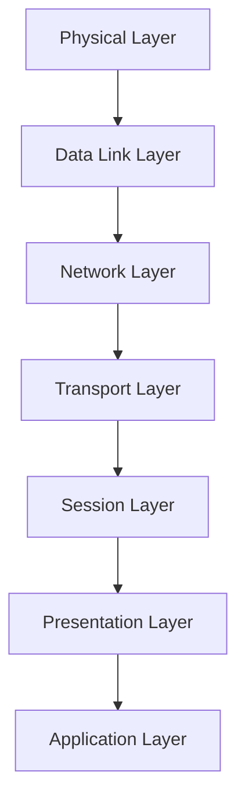

[[Start Page|На главную]]

---
# Оглавление
```table-of-contents
```

---
# DNS
## Работа с DNS-суффиксами
DNS-суффикс - это часть доменного имени, которая автоматически добавляется к короткому имени при поиске. Он избавляет от необходимости вводить полное доменное имя (FQDN). Например, делать обращение к `server1` вместо `server1.yourcompany.local`.
Типы суффиксов:
- Основной DNS-суффикс задаётся для самого компьютера (например, имя домена, к которому он принадлежит).
- Суффикс конкретного подключения, который позволяет привязать его к конкретному сетевому интерфейсу (типа vEthernet и т.д.).
### Windows. NRPT
В Windows можно использовать Name Resolution Policy Table (NRPT) для маршрутизации на основе политик. Работает на уровне DNS клиента до выбора сервера из настроек адаптера.
Таким образом можно выбрать, домены с каким суффиксом к какому DNS серверу будут обращаться (от имени администратора):
```powershell
Add-DnsClientNrptRule -NameSpace ".<company.suffix>" -NameServers ("<DNS_server_address1>", "<DNS_server_address2>") -DirectAccessEnabled
```
Очистка кэша DNS:
```PowerShell
Clear-DnsClientCache
```
Чтобы посмотреть список NRTP правил:
```powershell
Get-DnsClientNrptRule
```
Проверка работы политик:
```PowerShell
Get-DnsClientNrptPolicy -Effective
```
По GUID можно удалить правило:
```powershell
Remove-DnsClientNrptRule -Name "{<GUID>}"
```

### Linux systemd-resolve
Создаём файл `etc/systemd/network.d/00-override.network`. Прописываем в нём:
```ini
[Match]
Name=eth0

[Network]
Domains=~<domain.suffix>
DNS=<dns_ip>
```
Перезапустить службу `systemd-resolved`


---
## DNS over HTTPS (DoH)
### Linux
1. Установить dnscrypt-proxy.
2. Расчитать stamp в DNS Stamp calculator
3. Редактировать `/etc/dnscrypt-proxy/dnscrypt-proxy.toml`:
```toml
server_names = ['<dns_hostname>']
listen_addresses = ['127.0.0.1:53']
[static.'<dns_hostname>']
stamp = '<dns_stamp>'
```
4. Далее редактируем `/etc/systemd/resolved.conf`:
```.conf
[Resolve]
DNS=localhost
FallbackDNS=1.1.1.1 8.8.8.8 9.9.9.9
```
5. Запуск служб:
```bash
sudo systemctl daemon-reload
sudo systemctl enable --now dnscrypt-proxy systemd-resolved
```
6. Проверка:
```ssh
resolvectl status
```

---
# HTTPS
HTTPS - это безопасная версия протокола передачи данных HTTP, которая применяет криптографические протоколы SSL и TLS.
TLS (Transport Layer Security) - новый криптографический протокол, исправивший уязвимости SSL. На данный момент существуют версии tls1.2 и tls1.3, остальные устаревшие версии блокируются как ненадёжные.
SSL (Secure Sockets Layer) - сертификат, криптографический протокол, который предшествовал TLS.

SSL/TLS Сертификат - это цифровая подпись сайта. SSL неофициально синоним слова TLS, но в документации принято использовать термин TLS. Сайт передает сертификат браузеру пользователя, а тот верифицирует его в центре сертификации. Если всё хорошо, то устанавливается защищённое соединение. Помимо проверки подлинности сайта, он также шифрует полезную нагрузку.

## TLS Рукопожатие
Асимметричное - У каждой стороны есть публичный и частный ключ. Одна сторона обращается к другой по публичному ключу.
Симметричное - У обоих сторон есть общий секретный ключ.

При установлении HTTPS соединения, браузер и сервер обмениваются ключами асимметричным шифрованием, а затем устанавливают связь симметричным шифрованием.

По умолчанию для https используется порт 443.
## Работа с сертификатами
**Центр сертификации** - это организация, которая выпускает сертификаты и выступает доверенной стороной для браузеров. **ACME** - это протокол, через который клиент вроде Certbot автоматически запрашивает и продлевает сертификаты.
Настройка HTTPS почти всегда сводится к одной и той же цепочке:
1. Получение домена и его привязка с помощью DNS-сервера к конкретному серверу;
2. Проверка владения доменом;
3. Выпуск сертификата;
4. Настройка веб-сервера или платформы;
5. Проверка, что сайт нормально открывается по HTTPS.
# SNI
Server Name Identification позволяет обратиться к конкретному домену, когда на сервере размещено несколько сайтов. Он задаётся при рукопожатии TLS и является расширением протокола TLS. Так как TLS рукопожатие происходит перед тем, как отправляется HTTP запрос с заголовком `Host`, это вынуждает проводить рукопожатие с указанием SNI. В противном случае для каждого https сайта требовался бы отдельный ip адрес.
# ALPN
Application Layer Protocol Negotiation отправляет список поддерживаемых прикладных протоколов, что позволяет договориться с сервером об использовании конкретного (http версий 1.1, 2 и 3).

---
# Установка TLS Сертификата
Взят [отсюда](https://habr.com/ru/companies/amvera/articles/1022448/)
## Режим ручного DNS
Для этого достаточно запустить `acme.sh` с флагом `--dns`
```bash
acme.sh --issue --dns -d <domain> --yes-I-know-dns-manual-mode-enough-go-ahead-please
```
`--issue` - запрос на получение сертификата
`--dns` - без аргумента является режимом ручного DNS
Команда выдаёт `TXT` запись, которую необходимо добавить в доменную запись dns-хостинга. Центр сертификации затем сверяется с DNS сервером, где хранится запись о домене.
Спустя какое-то время, когда запись зарезолвится, нужно выполнить такую же команду, только с флагом `--renew`.
Проверка, зарезолвилось ли на dns сервере Google:
```
dig -t txt _acme-challenge.<domain> @8.8.8.8
```
Далее выполняем запускаем команду с флагом `--renew` и убеждаемся, что сертификат успешно выдаётся.
```
acme.sh --renew --dns -d <domain> --yes-I-know-dns-manual-mode-enough-go-ahead-please
```
`TXT` запись можно удалить из записи домена. При обновлении сертификата ключ остаётся такой же.

---
# Виды прокси серверов
- **Прямой (Forward) прокси** работает по инициативе **клиента** — он скрывает пользователя от сайтов (например, VPN или анонимайзеры).
- **Реверс-прокси** работает по инициативе **сервера** — он скрывает внутренние серверы компании от конечных пользователей

---
# Уровни сетевой коммуникации
Согласно сетевой модели OSI у нас есть 7 уровней абстракции:
1) Физический уровень: непосредственно оперирует необработанным потоком **битов** в физической среде.
2) Канальный уровень (data link layer): Физическая адресация **битов/кадров (frames)**, которая определяет передачу кадров между устройствами в локальной сети. Используются уникальные MAC-адреса для идентификации устройства.
3) Сетевой уровень: Логическая адресация **пакетов**, которая определяет путь до узла в сети Интернет. Используются IP-адреса. Приватные адреса для локальной сети, публичные — для глобальной сети. Переход от локальной сети в глобальную происходит через шлюз (gateway) на роутере с использованием протокола NAT для конвертации адресов.
4) Транспортный уровень: использует протоколы TCP и UDP для передачи **сегментов/датаграмм**. Здесь указываются порты для установки соединения, а также контрольные суммы.
5) Сеансовый уровень: управление сеансом связи для передачи **данных**. Контролирует порты и сессии?
6) Представительный уровень: отвечает за представление и шифрование **данных**.
7) Прикладной уровень: отвечает за взаимодействие клиента и сетевой службы, здесь реализуются сетевые протоколы верхнего уровня HTTP, FTP и др.



---
# URL, URN, URI
https://alekseev74.ru/lessons/show/http/uri-url-urn
# Как веб сервер обрабатывает несколько параллельных запросов на одном порту
[Источник](https://www.baeldung.com/cs/web-server-concurrent-requests-one-port)
Сначала веб сервер создаёт сокет слушателя (listener). Затем, когда несколько клиентов стучатся по порту, сервер выделяет под каждое соединение сокет и выполняет запросы на них.

---
# NAT
Network Address Translation позволяет общаться с другими сетями от имени роутера, то есть происходит перевод частных ip-адресов в публичные и наоборот (при получении данных из интернета).
Он использует `iptables` правила.
# Virtual Network (libvirt)
Он использует концепцию виртуальных (коммутаторов), сетевые интерфейсы которого можно просмотреть стандартными утилитами на linux.
Есть три режима работы виртуальных коммутаторов:
- По умолчанию используется NAT, который изолирует все узлы внутри локальной сети виртуальных машин.
- Но также есть режим `routed`, при котором виртуальный коммутатор подключается к физическому LAN интерфейсу хоста, тем самым пропуская трафик гостевой ОС без использования NAT.
- Изолированный режим позволяет общаться гостевым ОС и хосту между собой, но трафик не выйдет за пределы хоста.