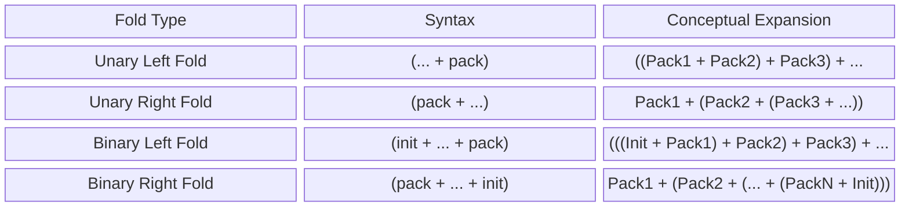

[[Start Page|На главную]]

---
# Оглавление
```table-of-contents
```

---
# C++11
## Барьеры памяти
Release-Acquire формирует одностороннюю связь, которая синхронизирует два потока. Release выплёскивает все изменения в поток acquire как посылку. Acqurie говорит, что все изменения в памяти принудительно заносятся в локальный кэш после load.
[Формулировка](https://habr.com/ru/articles/963818/): 
- `memory_order_release` в producer создает "барьер": все операции до `store` не могут быть переупорядочены после него.
- `memory_order_acquire` в consumer создает барьер: все операции после `load` не могут быть переупорядочены до него.
- Это создает отношение "happens-before" между потоками
Я так это понимаю:
Если мы производим `std::atomic<T>::store` с `memory_order_release`, то барьер работает так:
- Операции чтения и записи в память выше не могут идти ниже `store` (атомарные и обычные).
- Мы публикуем все изменения в памяти до store и как бы отпускаем те данные.
- Всё, что ниже становится непредсказуемым.
![[memory_barriers.jpg]]
## Atomic compare-exchange
`compare_exchange_weak` и `compare_exchange_strong` отличаются тем, что слабая может давать ошибки. А сильная обрабатывает ошибки внутри себя в цикле.
Херб Саттер (Herb Sutter) [вывел](https://stackoverflow.com/questions/66493926/dont-really-get-the-logic-of-stdatomiccompare-exchange-weak-and-compare-exc) простое правило для выбора:
1. Если вы пишете операцию в цикле (wait-loop) — используйте **`compare_exchange_weak`**.
2. Если вы делаете замену без цикла — используйте **`compare_exchange_strong`**. 
## Лямбда выражения
 У нас есть лямбда-выражение, которое не замыкается:
```cpp
auto callback = [](int x) -> int { return x + 2; };
```
Оно кастится в указатель на функцию, которую можно вызвать. Однако, если у нас есть замыкающееся lambda-выражение, то оно уже не сможет быть преобразовано в указатель на функцию и мы будем иметь дело с функциональным объектом.
```cpp
int var = 2;
auto callback_functor = [&var](int x) -> int { return x + var; };
```
## std::bind
`std::bind` - это адаптер функциональных объектов, который позволяет адаптировать их под заданное число параметров. Один из примеров использования следующий.
```cpp
template <class T>
struct Callee {
	constexpr T operator()(const T& lhs, const T& rhs) const { return lhs * rhs; }
};

template <class Callback>
void foo(const int a[], size_t n, Callback operation) {
	for (size_t i = 0; i < n; ++i) {
		std::cout << operation(a[i]) << ' ';
	}
	std::cout << std::endl;
}

int main() {
	const size_t N = 10;
    int a[N] = { 1, 2, 3, 4, 5, 6, 7, 8, 9, 10 };

	using _ph1 = std::placeholders::_1;
	auto square = std::bind(Callee<int>(), _ph1, _ph1);
	
	foo(a, N, square);
}
```
Вывод будет таким:
```output
1 4 9 16 25 36 49 64 81 100
```
Так, мы переопределили использование оператора `Callee`, изменив то, как мы подаём в неё аргументы: мы передаём первый аргумент (`std::placeholder::_1`) два раза для `lhs` и `rhs`.
## `std::shared_ptr`
Если производить наследование класса от `std::enable_shared_from_this`, то мы сможем безопасно создавать shared указатели внутри класса, при этом увеличивая счётчик. Для этого нужно вызывать `shared_from_this()` метод. Однако нам необходимо гарантировать, чтобы объект уже существовал внутри `std::shared_ptr`. Для этого можно использовать следующий паттерн:
```cpp
class SafeObject : public std::enable_shared_from_this<SafeObject> {
private:
	SafeObject(int value) : var(value) {
		std::cout << "True ctor" << std::endl;
	}
	struct PrivateToken {explicit PrivateToken() = default; };
public:
	SafeObject(PrivateToken, int value) : SafeObject(value) {
		std::cout << "Helper ctor" << std::endl;
	}
	
	static decltype(auto) create(int value) {
		return std::make_shared<SafeObject>(PrivateToken{}, value);
	}
	
	decltype(auto) get_self_ptr() {
		return shared_from_this();
	}
private:
	int var;
}
```
Если игнорировать это решение, то при попытке создать `auto ptr = std::make_shared(this)` создастся отдельный указатель со своим счётчиком, что может привести к проблеме двойной деаллокации.
## `std::weak_ptr`
Умный указатель, который хранит невладеющую (слабую) ссылку на объект, который управляется `std::shared_ptr`. Он позволяет наблюдать за объектом, не предотвращая его удаления, что позволяет эффективно определять, жив ресурс или нет. 
Ключевые моменты:
- Не владеет объектом, не влияет на счётчик `std::shared_ptr`.
- Нет прямого доступа через `->` или `*`. Необходимо временно сконвертировать к `std::shared_ptr` через метод `lock()`.

---
# C++20
## 1. Coroutines
Корутина - это функция, которая выполняется асинхронно без порождения потоков. Они хранят своё состояние в куче (не на стеке). Небольшой пример: когда компилятор видит унарный оператор `co_await`, он трансформирует функцию-операнд в корутину и усыпляет её, пока не потребуется возобновить её работу.
1. Внутри функции корутины мы вызываем co_await оператор, который вызывает suspend у awaiter.
2. Сама корутина возвращает возвращает объект, класс которого содержит `promise_type`.
3. В `promise_type` можно обратиться к дескриптору корутины и вызывать функцию `resume`.
4. Корутина возобновляет своё выполнение с того места, где был вызван `suspend`.
5. Если `promise_type` реализует `await_transform`, то к нему так же можно применить оператор корутины.
### 1.1. Ключевые слова
Это всё унарные операторы:
`co_await` - приостанавливает выполнение до возобновления.
`co_yield` - приостанавливает выполнение с возвращением значения.
`co_return` - завершает выполнение с возвращением значения.
### 1.2. Составляющие корутины
- `promise object` - через него передаём результат или исключение. Управляется внутри корутины. Не связан с `std::promise`.
- `coroutine handle` - не владеющий дескриптор используемый при возобновлении и уничтожении корутины. Манипулируется `Awaiter` объектом снаружи корутины. (Не владеющий, значит не управляющий жизненным циклом, аки сырой указатель вместо умного).
- `coroutine state` - внутреннее динамически аллоцированное хранилище состояния. Хранит в себе:
	- `promise object`
	- аргументы корутины (копируются по значению)
	- локальные переменные
	- точка возобновления
```MARKDOWN
┌──────────────────────────────────────────────────────────┐
│                   ФРЕЙМ КОРУТИНЫ                         │
│                                                          │
│ 1. [ Служебные данные компилятора (указатели, стейт) ]   │
│ 2. [ Копии аргументов вызова функции ]                   │
│                                                          │
│ 3. [ Объект promise_type ]                               │
│    └─ (В Asio тут хранится ссылка на executor,           │
│        состояние отмены, сигналы и т.д.)                 │
│                                                          │
│ 4. [ Локальные переменные корутины ]                     │
│    └─ (Например: ваш сокет, таймер, буферы)              │
└──────────────────────────────────────────────────────────┘
```
### 1.3. `Awaitable` и `Awaiter`
По моим наблюдениям операндом `co_await` всегда является `Awaitable` объект, который затем преобразуется в `Awaiter`. `Awaiter` объект определяет поведение оператора `co_await`.
Для `Awaitable` должны быть реализовываны:
- `Awaiter Awaitable::operator co_await()`
- `Awaiter operator co_await(Awaitable&)`
`Awaiter` должен иметь три метода:
- `bool await_ready()`
- `void await_suspend(std::coroutine_handle<>)`
- `T await_resume()`
Так у нас выходит следующая цепочка преобразований:
`expr → (Awaitable) → (Awaiter) → выполнение оператора co_await`
```cpp
auto result = co_await some_awaitable; 
// result ← то, что вернул awaiter.await_resume()
```
Причём может быть так, что `awaitable` объект является `awaiter`'ом.
### 1.4. Начало выполнения
1. Аллокация `state` объекта с помощью new.
2. Копирование параметров функции в `state` объект (осторожно с ссылками!).
3. Вызов конструктора объекта `promise`.
4. Вызов `promise.get_return_object()` и хранение результата выполнения корутины в локальной переменной. Результат этого вызова вернётся вызывающему при первой приостановке. Все исключения пробрасываются, не помещаясь в `promise`.
5. Вызов `promise.initial_suspend()` и `co_await` результата. Можно использовать `std::suspend_always` для лениво запускаемых корутин или `std::suspend_never` для активно запускаемых корутин.
6. Когда `co_await promise.initial_suspend()` возобновляется, начинается исполнение тела корутины.
### 1.5. Выполнение оператора `co_await`
Мы имеем `co_await expr;` Происходит следующее:
1. `expr` конвертируется в `awaitable` по правилам.
2. `co_await` оператор возвращает `awaiter` объект.
3. Далее вызывается `awaiter.await_ready()`. Если результат `false`, то вызывается `awaiter.await_suspend(handle);` Если результат `true`, то сразу вызывается `awaiter.await_resume()`.
4. Наконец, для возобновления корутины где-то вызывается `awaiter.await_resume()`.
5. По итогу всего выражения `co_await expr` мы получаем возвращаемое значение от `awaiter.await_resume()`.
### 1.4. Требования к корутинам
Каждая корутина должна иметь возвращаемое значение, которое удовлетворяет следующие требования.
Нельзя использовать:
- variadic arguments
- plain return statement
- placeholder return types (auto or Concept)
Не могут быть корутинами:
- consteval и constexpr functions
- constructors
- destructors
- main function
### 1.5. Promise
Описание
### 1.7. Пример
```cpp
int main(int argc, char* argv[]) {
	return 0;
}
```
## 2. Ranges
`std::ranges::stable_partition` - reorder elements.
## 3. Requires
Есть два вида `requires`:
- requires-expression для описания концептов
- requires-clause для прямого описания шаблонных функций
### 3.1 Requires-expression
Возвращает true или false в зависимости от того, компилируется ли описанный блок. Встречается в определении концепта, внутри require-clause или static_assert.
```cpp
concept my_concept = requires (parameter-list) {
	// simple requirements:
	parameter1 + paramter2;
	// compound requirements
	{ expression1 } -> type-constraint;
	{ expression2 } noexcept;
	{ expression3 };
	// Nested requirements:
	requires std::is_same<param2, std::string>;
}
```
### 3.2 Requires-clause
Применяет к шаблону логическое условие в compile time. Он встречается после списка параметров шаблона или сигнатуры функции.
```cpp
// type requirement
template <typename T> requires (std::is_void_v<T>)
void SomeFunction(T t);

// Trailing requirement (if not satisfied then ignore this overload)
template <typename T>
void OtherFunction(T t) requires (std::is_void_v<T>);
```

---
# Прочее
## Исключения
`category` используется для конструирования `error_code`. А `error_code` используется для конструирования `generic_error`/`system_error`/`runtime_error`.
## `std::decay` vs `std::remove_cvref_t`
И `std::decay`, и `std::remove_cvref_t`  удаляют из типа **ссылки**, приводя его к обычному значению, как при передаче аргумента в функцию по значению. Также удаляют из типа **квалификаторы** `const`/`volatile`. Однако `std::decay` идет дальше, преобразуя массивы и функции (ещё лямбды) в указатели. `std::remove_cvref_t` оставляет массивы и функции нетронутыми.
## std::make_tuple
Особое внимание стоит уделить созданию `std::tuple`, так как `std::make_shared` по сути производит `std::decay()`.
## std::tie
Эта функция создаёт временный набор ссылок на переменные, которые уже существуют в памяти. Использовать стоит аккуратно, так как можно создать висячие ссылки. Все объекты кастятся к lvalue reference.
## std::forward_as_tuple
Ведёт себя как `std::forward`

# Спецификаторы
- **`constexpr`** вычисляет значения в compile time, если возможно. Иначе считает в рантайме.
- **`consteval`** требует вычисления только в compile time и падает в ошибку, если не может отработать во время компиляции.
- **`constinit`** вынуждает переменную инициализироваться во время компиляции, оставляя возможность изменить значение переменной позже.
# Ссылки
## Коллапс ссылок
Нельзя самим писать ссылку на ссылку в объявлении переменной: `int & &`. Однако из-за шаблонов, `auto` и `alias` компилятору приходится сталкиваться с этим и он автоматически их сжимает по правилу (см. рисунок ниже).
Универсальных ссылок - не официальная концепция, которая выводится из правила коллапсирования ссылок.
![[cpp_reference_collapse.png]]
Когда работает:
- Вывод типов в шаблонах (Template Type Deduction), когда шаблонная функция принимает аргумент по универсальной ссылке (например, `T&&`);
- Идеальная передача (Perfect Forwarding) через `std::forward`;
- Псевдонимы типов (`typedef` или `using`);
- Использование ключевого слова `auto&&`.
Особенно интересно посмотреть на имплементацию `std::forward` и `std::move`. В первом случае мы кастим к `T&&`, которое может сколлапсировать в lvalue ref, либо в rvalue ref. В `std::move` мы производим чистый каст к rvalue: `static_cast<remove_reference_t<_Ty>&&>`.
Так `std::forward` не меняет физически ничего в объекте — он лишь **меняет категорию выражения**, восстанавливая семантику (ту информацию о value category аргумента, которая была "стёрта" фактом присвоения имени параметру).
# Templates
## Variadic Templates
Используется синтаксис:
```cpp
template <class... Args>
void foo(Args... args);
```
До C++17 необходимо рекурсивно производить работу с параметрами.
```cpp
#include <iostream>

// Base case: Called when there are no arguments left
void print() { std::cout << '\n'; }

// Variadic template function
template<typename Head, typename... Tail>
void print(Head head, Tail... tail) {
	std::cout << head << " ";
	// Recursively unpacks the remaining arguments
	print(tail...);
}

int main() {
	print(1, 2.5, "Hello", 'A'); // Prints: 1 2.5 Hello A
}
```
Начиная с C++ можно использовать `Fold Expressions`. Они позволяют раскрыть пачку параметров практически для всех бинарных операторов, которые всегда должны быть заключены в круглые скобки).


## Стирание типов
> [!UNDER CONSTRUCTION (TODO)]
> Исправить ошибки, объяснить как работает и зачем оно надо, почему по другому не надо. Проверить std::variants, std::string_view.

Стирание типов: `(void*) reinterpret_cast<void*>(bar)`;
Оно так же присутствует в std::functions, std::any и там где используется полиморфизм. Стирание типов ещё называется type erasure.
## Категории выражений (lvalue, rvalue...)
У нас есть типы переменных, которые могут быть ссылками (называются rvalue ссылка и lvalue ссылка). Но в каждом выражении они могут принимать разную категорию.
Выражение с любым именованным типом - это всегда lvalue категория вне зависимости от типа. Категория выражения напрямую определяет семантику для компилятора.
lvalue и rvalue - это категории выражений, влияющих на семантику работы с объектами. rvalue - это временное значение в памяти (литерал). lvalue постоянное именованное значение в памяти (переменная). xvalue (expiring value) - это значение gvalue, которое обозначает объект, ресусры которого можно повторно использовать. Например std::move(x). gvalue (generalized value) - это выражение, оценка (evaluation) которого определяет идентичность объекта или функции.
![[gvalue-rvalue-expressions.png]]
In C++, you must separate the **declaration type** of a variable from the **value category** of its name expression:
- **The Declaration Type:** `auto&&` is a **universal reference** (also called a forwarding reference). Depending on the initializer, the deduced type of `obj` can be an lvalue reference (`T&`) or an rvalue reference (`T&&`).
- **The Expression Category:** Any named variable expression is an **lvalue**. Even if `obj` has the type "rvalue reference", using the word `obj` evaluates to an lvalue because it has a name and an identifiable memory address.
Для закрепления:
![[cpp_ref_type_vs_value_category.png]]
# Универсальная ссылка
Если мы имеем шаблонный тип или тип `auto`, то можно создать универсальную ссылку:
```cpp
template<typename T>
void foo(T&& arg1, auto&& arg2);
// T&& is a universal reference
// auto&& is a universal reference
```
Если передаётся lvalue, то оно будет представлено как lvalue тип. Иначе как rvalue.
## decltype, declval
`decltype()` резолвит конечный тип всего выражения.
`declval<T>()` возвращает rvalue ссылку на объект класса, не вызывая конструктор. Таким образом можно извлекать тип членов класса без конструирования объекта посредством decltype(). Пример:

```cpp
#include <utility>

class A {
public:
	A() = delete;
	int foo() {
		return 7;
	}
};

int main(void) {
	decltype(std::declval<A>().foo()) variable = 7; // int
	return 0;
}
```
## Typename
typename позволяет явно указать компилятору, что мы имеем дело с типом, а не с полем класса (например когда мы работаем с шаблонами). Пример

```cpp
template<class T>
void foo() {
    typename T::boo variable = 7;
}

class A {
public:
    typedef unsigned long long boo;
    boo variable;
};  

class B {
public:
    double boo;
};

int main(void) {
    foo<A>(); // OK
    // foo<B>(); // Error: B class doesn't have boo type
    return 0;
}
```

## lambda
Если указать переменные в захватываемом контексте лямбды функции, то он будет представлен функциональным объектом (его нельзя будет скастить в указатель на функцию). Если же например контекст будет пустым, то его можно будет скастить к указателю на функцию.

---
# Boost-Asio

## 1. `io_context`
Это контекст выполнения асинхронных операций в boost. Его можно запускать в нескольких потоках. Для этого в каждом потоке надо вызвать `ctx.run();`
```cpp
using namespace boost::asio;
io_context ioc;
std::jthread([&]{ioc.run()});
```
## 2. `io_context::strand`
Эта штука позволяет выполнять non-concurreny (последовательно) способом асинхронные операции. Например у нас есть `ctx`, который запущен на двух потоках. Часть асинхронных операций работают прямо на нём (задачи глобальной очереди), а часть на `strand` (своя очередь), который к нему привязан. Все асинхронные операции внутри `strand` будут работать не асинхронно по отношению друг к другу.

Будут ли другие потоки простаивать?
Нет. Возьмём пример, если `Thread 1` сейчас выполняет обработчик для `Connection A` внутри его `strand`, то `Thread 2` в это же время может спокойно обрабатывать `Connection B` в его собственном `strand`, а `Thread 3` — принимать новое соединение (`async_accept`).
Простой возникнет только в одном случае: если у нас всего одно активное соединение (один `strand`) и 4 потока. Тогда 1 поток будет работать, а 3 — спать в ожидании других задач. Именно поэтому для каждого нового соединения создается свой, отдельный `strand`.
## 3. `executor_work_guard<io_context>`
Если все операции в очереди выполнятся, то эта штука не позволит вернуть управление из `ctx.run()` и она продолжит своё выполнение в ожидании новых задач.
```cpp
using namespace boost::asio;
io_context ioc;
auto work_guard = make_work_guard(ioc);
std::jthread([&]{ioc.run()}); // Will continue working even if no tasks being pushed.
work_guard.reset(); // Remove guard, so ioc.run() will work as usual. If no tasks, then ioc.run() is being returned.
```
## 4. `dispatch` vs `post`
- `dispatch(handler)` - быстрая (синхронная): позволяет вызвать обработчик сразу внутри функции, если работает в том же потоке, что и `io_context.run()`. Есть риск рекурсии
- `post(handler)` - отложенная обработка: отправляет обработчик в очередь. Будет выполняться после `io_context.run()`.
## 5. `write` vs `write_some`
`write` гарантирует полную доставку буфера, а `write_some` - нет. Во втором случае мы сами должны реализовать полноценный `write`
## 6.`write/read` vs `write_some/read_some`
Отличие в том, что `write/read` это более высокоуровневая функция, которая гарантирует, что все данные были переданы, в отличие от `write_some/read_some`.
## 7. Закрытие соединений (Boost.Beast)
Для закрытия обычного сокета достаточно `tcp_stream.close();`
Для закрытия SSL/TLS соединений нужно отправлять дополнительные сигналы о закрытии соединения во избежание `truncation attack`. Делается это так: `ssl_stream.shutdown()`.
Для закрытия WebSocket:
```cpp
// Send the close frame in sync mode
ws.close(boost::beast::websocket::close_code::normal, ec);

void close_session()
{
    // ...
    ws_.async_close(
        boost::beast::websocket::close_code::normal,
        boost::beast::bind_front_handler(
            &session::on_close, // A handler to manage the read loop
            shared_from_this()));
}

void on_close(boost::beast::error_code ec)
{
	if (ec == boost::beast::websocket::error::closed)
    {
        // The connection is fully closed. The session can now safely end,
        // and resources will be freed (e.g., via shared_ptr going out of scope).
        return; 
    }

    if (ec) { /* handle other errors */ return; }

    // Keep reading until error::closed is returned
    ws_.async_read(
        buffer_,
        boost::beast::bind_front_handler(
            &session::on_close,
            shared_from_this()));
}
```
## 8. `CompletionToken`
## 8.1 `use_awaitable`
## 8.2. `detached`
## 8.3 `deferred`
## 8.4 use_future
## Token Adapters
You can wrap the tokens above using **adapters** to inject special behaviors into the completion handler. 
- **`boost::asio::as_tuple`**: Packages the arguments (`std::exception_ptr`, `R`) into a `std::tuple`, preventing exceptions from being thrown directly out of a `co_await` expression.
- **`boost::asio::redirect_error`**: Redirects a failure to a `boost::system::error_code` object instead of throwing an exception.
- **`boost::asio::bind_executor`**: Guarantees that the completion handler runs within a specific executor or strand, regardless of where the coroutine finished.
- **`boost::asio::bind_allocator`**: Directs the internal handler mechanisms to use a custom memory allocator.
- **`boost::asio::bind_cancellation_slot`**: Associates a cancellation slot to track or trigger early teardown of the spawned context
## 9 Buffers
### 9.1 Basic / Raw Memory Buffers
These represent a contiguous region of raw memory (a tuple of a pointer and size) and form the foundation of Boost I/O.
- **`const_buffer`**: Non-modifiable buffer created from const-qualified memory.
- **`mutable_buffer`**: Modifiable region of memory; convertible to a `const_buffer`.
- **Creation (`boost::asio::buffer`)**: These are created using the `buffer()` function overloads, taking objects like `std::vector`, `std::string`, or raw arrays.
### 9.2 Dynamic Buffers
Dynamic buffers encapsulate memory that automatically resizes as needed for I/O operations (like socket reads/writes). The memory is divided into readable bytes followed by writable bytes.
- **`dynamic_vector_buffer`**: Adapts an existing `std::vector` to act as a dynamic buffer.
- **`dynamic_string_buffer`**: Adapts an existing `std::string` for dynamic resizing.
### 9.3 Flat Buffers
Flat buffers guarantee that all readable and writable bytes are stored in a contiguous, single memory sequence.
- **`flat_buffer`**: Uses default heap allocation. It is highly useful when contiguous memory is strictly required for parsing protocols or message structures.
- **`flat_static_buffer`**: An optimization that allocates a fixed-size internal buffer (on the stack or as a member) to avoid heap allocations entirely, provided the message size doesn't exceed the capacity. 
### 9.4 Multi-Buffers
- **`multi_buffer`**: Behaves similarly to a `std::deque`. Instead of reallocating a single massive block of memory, it uses a sequence of multiple byte arrays. When reading/writing large streams, this avoids the cost of continuously copying and reallocating contiguous memory.
### 9.5 Stream Wrappers
- **`make_printable`**: Not a buffer type itself, but a utility wrapper that converts a buffer sequence so it can be safely printed to a `std::ostream` (such as `std::cout`).

---
# CMake
## Техники для сборки проекта
Можно все 3rd party зависимости слить в одну DLL, в которой есть модули для взаимодействия с эти библиотеками. Таким образом линковка с основным проектом будет происходить быстро. Кроме того, можно включить оптимизацию для этого таргета, так что можно будет повысить производительность отлаживаемого бинарника.

---
# VCPKG
## База
Registry - это реестр пакетов. Baseline - это хэш коммита данного реестра. Есть два режима установки пакетов: классический (с глобальной установкой пакетов) и режим манифеста (с локальной установкой пакетов в `vcpkg_install`). Чтобы войти в режим манифеста, нужно создать файлы манифеста: `vcpkg.json` (там перечисляются пакеты) и `vcpkg-configuration.json` (там содержатся ссылки на реестры пакетов). Эти файлы создаются командой `vcpkg new --application`. Затем можно добавлять пакеты. Для этого используем команду `vcpkg add port <package_name>`. Готово.

## Baseline
Это конкретная ревизия реестра пакетов. Чтобы сделать его фиксированным нужно выполнить команду:
```bash
vcpkg x-update-baseline --add-initial-baseline
```
Он вернёт актуальный хэш ревизии реестра, а опция `--add-initial-baseline` добавит этот хэш в `vcpkg.json` по ключу `builin-baseline`.

## Конкретные версии
Нужно использовать `override` для указания версий. Например:
```json
{
  "name": "my-project",
  "version": "1.0.0",
  "dependencies": [
    "zlib",
    "fmt"
  ],
  "overrides": [
    { "name": "zlib", "version": "1.2.8" },
    { "name": "fmt", "version": "10.1.1" }
  ],
  "builtin-baseline": "3426db05b996481ca31e95fff3734cf23e0f51bc"
}
```
Для получения builtin-baseline репозитория vcpkg:
```bash
git rev-parse HEAD
```

## Интеграция с CMake
Интегрируем через toolchain:
`CMAKE_TOOLCHAIN_FILE": "$env{VCPKG_ROOT}/scripts/buildsystems/vcpkg.cmake`
