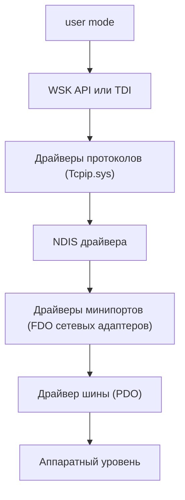

[[Start Page|На главную]]

---
# Оглавление
[[#Заметки от начинающих]]
[[#Типы драйверов реализующие различные модели драйверов]]
[[#Сетевой стек ядра]]
[[#Работа с заголовком ndis.h]]

---
# Заметки от начинающих

WDM - это концепция, которая определяет некоторые стандарты для разработки различных типов драйверов, которые обеспечивают обратную совместимость со всеми версиями Windows.
Все WDM драйвера обязаны:
- Включать Wdm.h (не Ntddk.h)
- Быть спроектированными как один из трёх типов драйверов: bus driver, functional driver, filter driver
- Создавать объекты устройств
- Поддерживать Plug and Play
- Поддерживать управление питанием
- Поддерживать WMI

---
## Типы драйверов реализующие различные модели драйверов
- Драйвер шины: перечисляет устройства на шине (PCI, USB, SCSI и т.д.) и администрирует над ними.
- Драйвер функциональный: напрямую общается с устройствами. Поставляется вендором и отвечает за I/O операции к устройствам. Он знает реализацию устройств.
- Драйве фильтрации (filter driver) - опциональный драйвер, который получает, просматривает и модифицирует данные, идущие между отдельными драйверами, либо между пользовательскими приложениями и драйверами
- Программный драйвер (software driver): предоставляет доступ пользовательскому приложению к пространству ядра
- Драйвер файловой системы (filesystem driver)

---
# Сетевой стек ядра

*В схеме опущены драйверы фильтров между слоями*

[user mode] -> [WSK API или TDI] -> [Драйверы протоколов (Tcpip.sys)] -> [NDIS драйвера] -> [Драйверы минипортов (FDO сетевых адаптеров)] -> [Драйвер шины (PDO)] -> [Аппаратный level]

* WSK API или TDI - API для взаимодействия с сетью в режиме ядра (в настоящий момент используется в основном WSK).
* Драйверы протоколов - маршрутизация, обработка сетевых пакетов, управление соединениями.
* NDIS - обеспечивает унифицированный интерфейс между протоколами и сетевыми картами, мультиплексирование (работа нескольких протоколов через одну сетевую карту).
* Драйверы минипортов - Функциональные драйвера конкретных сетевых адаптеров.

*Предполагается что драйвер для VPN будет фильтрующим NDIS драйвером (будет встроен между драйверами протоколов и NDIS)

---
# Работа с заголовком ndis.h
Некоторые полезные и необходимые макросы для работы с заголовком ndis.h 
- Версия ndis
- NDIS_WDM
- NDISLWF

#Версия ndis
Для работы с заголовком ndis.h НЕОБХОДИМО указать версию NDIS (иначе ниче рабоать не будет), в зависимости от версии будут доступны те или иные структуры и функции.

Для указания версии можно явно прописать макросы ПЕРЕД заголовком ndis.h NDIS_MINIPORT_MAJOR_VERSION и NDIS_MINIPORT_MINOR_VERSION, например:

\#define NDIS_FILTER_MAJOR_VERSION 6 		// число перед точкой
\#define NDIS_FILTER_MINOR_VERSION 60		// число после точки

Но рекомендуется делать это через макросы NDISxyy, где x - major version, y - minor version, например:

\#define NDIS660 1

Основные доступные версии:
- Windows Vista - 6.0 				(NDIS60)
- Windows 7 - 6.1 					(NDIS61)
- Windows 8 - 6.30 					(NDIS630)
- Windows 8.1 - 6.40 				(NDIS640)
- Windows 10 (1507 - 1607) - 6.50 	(NDIS650)
- Windows 10 (1703 - 2004) - 6.60 	(NDIS660)
- Windows 11 - 6.70 				(NDIS670)

#NDIS_WDM
Макрос NDIS_WDM=1 указывает что драйвер использует NDIS совместно с WDM. Включает поддержку WDM. Следует указывать ПЕРЕД включением ndis.h

#NDISLWF
Макрос NDISLWF=1 указывает что что драйвер является фильтрующим. Он так же включает специфичные для фильтров определения и отключает неподходящие части API. Следует указывать ПЕРЕД включением ndis.h
