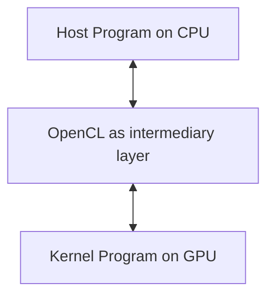

```table-of-contents
```
---
# Основные понятия
Код, который выполняется на CPU называется host кодом. Он загружает на GPU код, который называется kernel. В частности так называют конкретные функции в OpenCL коде.



# Разбиение на задачи
Так как GPU обладает параллелизмом, вся задача делится на отдельные потоки выполнения, которые называют **work item**. Множество таких item'ов можно геометрически уложить в рабочие группы, будь то ряд, таблица, куб и т.д. У всей задачи есть глобальная размерность и размеры по каждому измерению.

Work item'ы группируются в рабочие группы (**working group**) которые имеют строго одинаковый размер и каждая группа имеет локальную память. Для них указываются локальные размерности и размеры по измерениям.

Промежуточным способом группировать задачи является **warp** (или wavefront). Их стандартный размер 32 или 64. Из них состоят рабочие группы. Их геометрия (размерность и количество item'ов) формируется внутри OpenCL за API. В одном таком ворпе происходит синхронное выполнение инструкции на едином блоке управления

![[GPGPU_work_item_model.png]]
#  Как выбирать размеры задач
Размер рабочей группы желательно делать кратной размеру ворпа. В противном случае создаются холостые потоки. Также ограничением для размера рабочей группы выступает лимит локальной памяти.

Алгоритм подбора размера рабочей группы:
- узнать размер доступной локальной памяти;
- узнать ограничения устройства на длину, ширину и глубину рабочей группы;
- узнать, сколько локальной памяти требует конкретный kernel для внутренних нужд,
- исходя из всех ограничений выбрать оптимальный размер рабочей группы, делящийся на 64.
Можно ещё подумать над оптимальными геометриями рабочих групп:
- квадратные группы
- вертикальные
- горизонтальные
Но на этот счёт лучше провести своё исследование.
# Проблема дивергенции
Объединённые одним блоком управления, работы в ворпе обрабатываются синхронно. В случае прохождения через условные конструкции work item'ы, которые не прошли по условию работают в холостую. Потом в альтернативной условной ветке они меняются местами и теперь в холостую будет работать другое множество work item'ов.
Это может быть серьёзно, например, в алгоритме бинарного поиска, где ветвление ведёт к рекурсивному вызову. Как результат у нас логарифмическая сложность сменяется линейной.
# Computing Unit
Computing unit состоит из:
- Processing Element (маленькое вычислительное ядро)
- Local/Shared memory
- Регистры
- Control Logic (менеджер, который говорит ядрам, какую инструкцию выполнять)
# Квалификаторы указателей в kernel коде
Внутри OpenCL C kernel коде указатели должны быть явно квалифицированы регионом памяти. Указатель не может существовать без знания того, куда он указывает.
- **`__global`**: Pointers to the main GPU memory (visible to all threads).
- **`__local`**: Pointers to shared memory within a work-group.
- **`__private`**: Pointers to thread-specific registers.
- **`__constant`**: Pointers to read-only global memory.
# Указание размера Work Group
To calculate the work-group sizes for an OpenCL kernel program, you must ==balance **hardware limitations** with **mathematical padding** to match your overall data set size==.
1. Query Hardware Limits
You cannot pass arbitrary sizes to the OpenCL runtime. First, check your physical hardware limits and kernel constraints programmatically via the Host API:
- **Device Maximum limit**: Retrieve `CL_DEVICE_MAX_WORK_GROUP_SIZE` to find the absolute maximum number of execution threads permitted in a single work-group by the hardware.
- **Kernel Compilation limit**: Retrieve `CL_KERNEL_WORK_GROUP_SIZE` using `clGetKernelWorkGroupInfo`. This value depends on register and local memory usage within your specific compiled kernel and is often smaller than the device maximum.
- **Preferred Multiple**: Query `CL_KERNEL_PREFERRED_WORK_GROUP_SIZE_MULTIPLE` to find the hardware's native processing chunk size (e.g., Warp size of 32 on NVIDIA or Wavefront size of 64 on AMD).

2. Determine Local Work Size (Threads per Group)

For maximum efficiency, your local work size should be a multiple of the preferred hardware size and must not exceed the kernel limit.
- **General Rule**: A local size of **64, 128, or 256** threads is usually the sweet spot for modern GPUs.
- **Multidimensional Layouts**: If working with a 2D matrix, break your local dimensions down so their product fits the limit. For example, a 16 × 16 grid equals 256 total local items.
3. Calculate Global Work Size (Total Threads)
OpenCL requires that the total `global_work_size` must be **exactly divisible** by the `local_work_size` for every dimension. If your dataset size does not perfectly divide by your chosen local size, you must pad the global size upward to the nearest multiple using the ceiling function. 

For each dimension i:  
```
\(\text{global\_size}[i]=\left\lceil \frac{\text{dataset\_size}[i]}{\text{local\_size}[i]}\right\rceil \times \text{local\_size}[i]\)
```

4. Implement Out-of-Bounds Guards
Because padding increases the global work size, your kernel will generate extra "dummy" threads that extend beyond your actual dataset boundary. To prevent memory corruption or crashes, you must add a boundary check at the very beginning of your kernel execution:

```c
__kernel void my_kernel(__global float* data, int dataset_size) {
    int gid = get_global_id(0);
    
    // Boundary check guard
    if (gid >= dataset_size) {
        return; 
    }
    
    // Safe to process data below
    data[gid] *= 2.0f;
}
```

Используйте код с осторожностью.
5. Automation Option
If optimization is not critical for your current development phase, you can pass `NULL` (or `nullptr`) to the `local_work_size` parameter inside `clEnqueueNDRangeKernel`. The OpenCL driver implementation will automatically calculate and assign a legal, reasonably optimized local work-group configuration for your device.