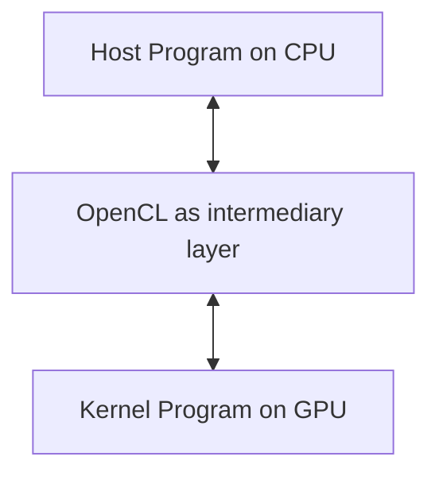

```table-of-contents
```
---
# Основные понятия
Код, который выполняется на CPU называется host кодом. Он загружает на GPU код, который называется kernel. В частности так называют конкретные функции в OpenCL коде.



# Разбиение на задачи
Так как GPU обладает параллелизмом, вся задача делится на отдельные потоки выполнения, которые называют **work item**. Множество таких item'ов можно геометрически уложить в рабочие группы, будь то ряд, таблица, куб и т.д. У всей задачи есть глобальная размерность и размеры по каждому измерению.

Work item'ы группируются в рабочие группы (**working group**) которые имеют строго одинаковый размер и каждая группа имеет локальную память. Для них указываются локальные размерности и размеры по измерениям.

Промежуточным способом группировать задачи является **warp** (или wavefront). Их стандартный размер 32 или 64. Из них состоят рабочие группы. Их геометрия (размерность и количество item'ов) формируется внутри OpenCL за API. В одном таком ворпе происходит синхронное выполнение инструкции на едином блоке управления

![[GPGPU_work_item_model.png]]
#  Как выбирать размеры задач
Размер рабочей группы желательно делать кратной размеру ворпа. В противном случае создаются холостые потоки. Также ограничением для размера рабочей группы выступает лимит локальной памяти.

Алгоритм подбора размера рабочей группы:
- узнать размер доступной локальной памяти;
- узнать ограничения устройства на длину, ширину и глубину рабочей группы;
- узнать, сколько локальной памяти требует конкретный kernel для внутренних нужд,
- исходя из всех ограничений выбрать оптимальный размер рабочей группы, делящийся на 64.
Можно ещё подумать над оптимальными геометриями рабочих групп:
- квадратные группы
- вертикальные
- горизонтальные
Но на этот счёт лучше провести своё исследование.
# Проблема дивергенции
Объединённые одним блоком управления, работы в ворпе обрабатываются синхронно. В случае прохождения через условные конструкции work item'ы, которые не прошли по условию работают в холостую. Потом в альтернативной условной ветке они меняются местами и теперь в холостую будет работать другое множество work item'ов.
Это может быть серьёзно, например, в алгоритме бинарного поиска, где ветвление ведёт к рекурсивному вызову. Как результат у нас логарифмическая сложность сменяется линейной.
# Computing Unit
Computing unit состоит из:
- Processing Element (маленькое вычислительное ядро)
- Local/Shared memory
- Регистры
- Control Logic (менеджер, который говорит ядрам, какую инструкцию выполнять)