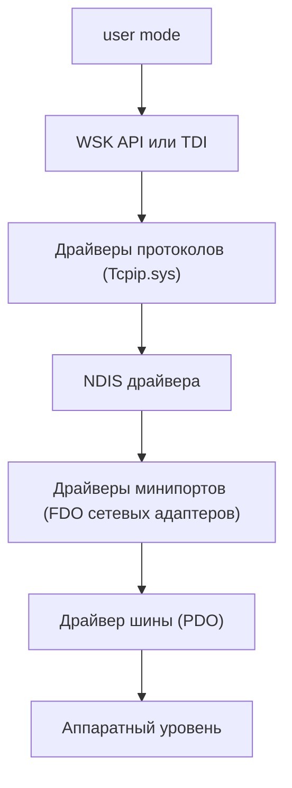

[[Start Page|На главную]]

---
# Оглавление
```table-of-contents
```

---
# Заметки от начинающих

WDM - это концепция, которая определяет некоторые стандарты для разработки различных типов драйверов, которые обеспечивают обратную совместимость со всеми версиями Windows.
Все WDM драйвера обязаны:
- Включать Wdm.h (не Ntddk.h)
- Быть спроектированными как один из трёх типов драйверов: bus driver, functional driver, filter driver
- Создавать объекты устройств
- Поддерживать Plug and Play
- Поддерживать управление питанием
- Поддерживать WMI

---
# Внутренний обзор Windows
## Процессы
Процесс - это контейнер, изолирующий виртуальную память, который управляет потоками в нём. Если посмотреть абстрактно, то процессу принадлежит:
* Приватное виртуальное адресное пространство процесса;
* Потоки;
* Первичный токен - объект для хранения стандартного контекста безопасности процесса (используется потоками, может решает, какой поток должен работать в настоящий момент?);
* Приватная таблица с дескрипторами объектов (файлы, семафоры и т.д.);
* Образ с программой со всем исходным кодом.
Каждому процессу соответствует уникальный идентификатор.
## Как загружаются драйвера
I/O Manger вызывает `DriverEntry` рутину, когда он загружает драйвер. Эта рутина вызывается в контексте системного потока с IRQL 0 (PASSIVE LEVEL). [Stack Overflow](https://stackoverflow.com/questions/53451506/what-process-is-a-device-driver-loaded-into-on-windows) [MSDN](https://learn.microsoft.com/en-us/windows-hardware/drivers/kernel/writing-a-driverentry-routine)
## Виртуальная память
## Потоки
## Системные службы
## Системная архитектура
## Дескрипторы и объекты

---
# Механизмы ядра
## Interrupt Request Level
Механизм прерываний нужен для того, чтобы позволить прервать выполнение инструкций на процессоре и обработать сигналы, поступающие с оборудования. Мы хотим обработать сигналы оборудования как можно быстрее, чтобы уменьшить задержки. Поэтому они обладают более высоким приоритетом выполнения, чем пользовательский код или код в режиме ядра.
IRQL следует воспринимать как регистр процессора.
У нас есть несколько уровней запросов прерывания. Уровень 0 соответствует обычному выполнению кода. Это пассивный уровень. Там работает несколько процессов, со своими потоками, а планировщик управляет переключениями между потоками. Уровень 1 обладает более высоким приоритетом, и в нём вызываются асинхронные процедуры (APC).
На уровне 2 работает планировщик потоков. Поэтому начиная с этого уровня, его работа приостанавливается и дальнейшее выполнение инструкций происходит без переключения контекста процессора.
* В связи с этим также не возможно обращение к выгруженной памяти (т.е. нельзя обращаться к памяти, которая может быть выгружена на диск). Безопасно использовать только невыгружаемую память, то есть ту, которая гарантирует, что её содержимое не будет выгружена наружу системы (на диск и т.п.).
* Ожидание объектов диспетчеризации режима ядра (мьютексу или событию) запрещено из-за заблокированного планировщика.
Для изменения уровня запроса прерывания можно использовать функции `KeRaiseIrql` и `KeLowerIrql`. При повышении уровня, рекомендуется перед возвращением функции понижать этот уровень, чтобы это снизить риски падения системы.
IRQL не следует путать с приоритетом потока. IRQL - это атрибут процессора (его надо воспринимать как регистр)
Количество процессорного времени, потраченного на прерывания можно посмотреть в Диспетчере задач, а также в Process Explorer.
## Аннотации IRQL для драйверов
См. документацию на [MSDN](https://learn.microsoft.com/en-us/windows-hardware/drivers/devtest/irql-annotations-for-drivers). Здесь описывается применение аннотаций в коде для того, чтобы следить за корректным применением функций изменения IRQL с помощью статических анализаторов. Например, можно использовать `_IRQL_requires_same_` для того, чтобы указать, что на входе и выходе из функции значение IRQL было одинаковым.
## Deferred Procedure Calls
DPC механизм представляет собой объект, инкапсулирующий в себе процедуру, работающую на уровне IRQL 2 (DISPATCH LEVEL). DPC помещаются в очередь текущего процессора.

Рассмотрим пример с чтением данных с диска. В пользовательском режиме мы вызываем функцию `ReadFile`. Далее `I/O Manager` формирует `IRP` и вызывает драйвер файловой системы `NTFS`. Этот драйвер инициирует операцию с аппаратным обеспечением через его драйвер. Происходит прерывание с высоким приоритетом, при котором в ISR идёт чтение данных с диска. По окончании операции необходимо завершить IRP запрос функцией `IoCompleteRequest`. Однако её мы можем вызывать при более низких уровнях запроса прерывания (`IRQL <= 2`). Для этих целей был создан компромисс в лице DPC, который внутри ISR помещается в очередь на исполнение. Регистрация самой процедуры происходит заранее в драйвере, который зарегистрировал ISR. По завершению вызова ISR, происходит проверка на наличие DPC в очереди. Если они есть, то задаётся IRQL=2 (DISPATCH LEVEL) не мешая аппаратным прерываниям. После выполнения всей очереди IRQL выставляется в 0.

DPC также удобно использовать в качестве callback-функции в таймере ядра. DPC в виду более высокого приоритета, чем обычные callback-функции, работает быстрее
## Asynchronous Procedure Calls
APC тоже представляют собой структуры, инкапсулирующие в себе функции, но в отличие от DPC их может вызывать только тот поток, к которому они привязаны. Каждый поток имеет свою APC очередь.

Есть три режима APC:
* Пользовательский - работает в IRQL 0, только когда поток попадает в тревожное (alertable) состояние. В этом состоянии, если очередь не пустая, то он выполняет все APC.
* Нормальные ядровые APC - выполняются так же на IRQL 0 с вытеснением пользовательского кода и пользовательского APC.
* Специальные ядровые APC - выполняются в IRQL 1 (APC LEVEL). Вытесняет пользовательские код и APC, а также нормальный kernel APC.
Критические секции (critical regions) позволяют вызывать только специальные ядровые APC (IRQL APC LEVEL). Устанавливаются с помощью функций `KeEnterCriticalRegion` и `KeLeaveCriticalRegion`.
Защищённые секции (guarded regions) запрещают в принципе вызывать APC.  Устанавливаются с помощью функций `KeEnterGuardedRegion` и `KeLeaveGuardedRegion`.
## SEH
## System Crash
Когда система крашится, она делает дамп системы. Если система зависла, то мы можем подключиться с дебагером и собрать дампы. Можем также запустить программу notmyfault.exe и крашнуть систему вручную. Тогда мы получим дамп. Если же система вообще не отвечает, то мы можем заранее установить значение в регистре, которое позволит нам крашнуть систему сочетанием клавиш (драйвер клавиатуры сгенерирует падение системы).
## Thread Synchronization
### Interlocked functions
Функции со взаимоблокировкой (Interlocked functions) нужны для выполнения атомарных операций на уровне оборудования без использования программных объектов, что повышает эффективность. Таким образом мы решаем проблему гонки данных с помощью атомарности операций. Это может быть например операция атомарного инкремента, где два процессора инкрементируя одну и ту же переменную с нуля в результате получают число 2, а не 1, благодаря атомарности.
### Dispatcher objects
Объекты диспетчеризации - это примитивы синхронизаций, которые обладают состояниями `Signaled` и `Non-signaled`. Они используются в функциях `KeWaitForSingleObject` и `KeWaitForMultipleObjects`. Есть несколько типов объектов диспетчеризации и то, какое состояние они примут зависит от типа. Типы: процесс, поток, мьютекс, событие, семафор, таймер, файл.
### Mutex
Примитив синхронизации, который имеет статус `Signaled`, когда он освобождён. Он представляет собой структуру `KMUTEX`, которую нужно инициализировать функцией `KeinitializeMutex` выделяя память из невыгружаемого пула. Чтобы захватить мьютекс нужно вызвать `KeWaitForSingleObject`, а чтобы отпустить `KeReleaseMutex`. Поток, который владеет мьютексом, может захватывать его несколько раз, но обязуется освободить его такое же количество раз.
Необходимо позаботиться о том, чтобы мьютекс был освобождён в случае возникновения исключений. Для этого его можно поместить в `__finally` блок механизма SEH. Или использовать RAII идиому на уровне обёртки над мьютексом (аля `guardlock` из `std`).
### Fast mutex
Такой же, как и обычный, но он использует свою API, его нельзя вызывать рекурсивно (приводит к deadlock), ему нельзя задать таймаут. За счёт этого он работает быстрее и его рекомендуется рассматривать при работе в режиме ядра. В пользовательском режиме он не доступен. Его также можно завернуть в RAII обёртку.
### Semaphore
Представляет собой счётчик, который находится в состоянии `Signaled`, если он не равен нулю. У него есть максимальное значение. Если мы занимаем семафор, то счётчик опускается на единицу, если отпускаем семафор, то счётчик восстанавливается на единицу. Таким образом можно например ограничить размер очереди, по отношению к которой применяются асинхронные операции.
Если максимальное значение семафора равно единице, то он не будет мьютексом, так как состояние мьютекса может контролировать только захвативший его поток.
### Event
Структура события инициализируется из невыгружаемого пула памяти и принимает состояние true (`Signaled`) и false (`Non-signaled`). Оно имеет два типа:
* уведомление - разблокирует все потоки, но сброс до false идёт вручную.
* синхронизация - разблокирует максимум один поток и сброс до false происходит автоматически.
### Executive Resource
Ресурс исполнительной системы не является объектом диспетчеризации. Он нужен для того, чтобы позволить потокам, которые только читают данные, получить доступ к общему ресурсу. Как только появляется поток, который хочет записать данные, он блокирует ресурс для себя. Это обязательно должно происходить без вызовов APC, так что нужно объявлять `CriticalRegion`, не забывая потом его убрать после нужных операций.
По сути это такая оптимизация, ведь если мы оперируем мьютексами, то мы не можем обеспечить параллелизм для читающих потоков.
## High IRQL Synchronization
## Work items

---
## Типы драйверов реализующие различные модели драйверов
- Драйвер шины: перечисляет устройства на шине (PCI, USB, SCSI и т.д.) и администрирует над ними.
- Драйвер функциональный: напрямую общается с устройствами. Поставляется вендором и отвечает за I/O операции к устройствам. Он знает реализацию устройств.
- Драйве фильтрации (filter driver) - опциональный драйвер, который получает, просматривает и модифицирует данные, идущие между отдельными драйверами, либо между пользовательскими приложениями и драйверами
- Программный драйвер (software driver): предоставляет доступ пользовательскому приложению к пространству ядра
- Драйвер файловой системы (filesystem driver)

---
# Сетевой стек ядра

*В схеме опущены драйверы фильтров между слоями*

[user mode] -> [WSK API или TDI] -> [Драйверы протоколов (Tcpip.sys)] -> [NDIS драйвера] -> [Драйверы минипортов (FDO сетевых адаптеров)] -> [Драйвер шины (PDO)] -> [Аппаратный level]

* WSK API или TDI - API для взаимодействия с сетью в режиме ядра (в настоящий момент используется в основном WSK).
* Драйверы протоколов - маршрутизация, обработка сетевых пакетов, управление соединениями.
* NDIS - обеспечивает унифицированный интерфейс между протоколами и сетевыми картами, мультиплексирование (работа нескольких протоколов через одну сетевую карту).
* Драйверы минипортов - Функциональные драйвера конкретных сетевых адаптеров.

*Предполагается что драйвер для VPN будет фильтрующим NDIS драйвером (будет встроен между драйверами протоколов и NDIS)

---
# Работа с заголовком ndis.h
Некоторые полезные и необходимые макросы для работы с заголовком ndis.h 
- Версия ndis
- NDIS_WDM
- NDISLWF

#Версия ndis
Для работы с заголовком ndis.h НЕОБХОДИМО указать версию NDIS (иначе ниче рабоать не будет), в зависимости от версии будут доступны те или иные структуры и функции.

Для указания версии можно явно прописать макросы ПЕРЕД заголовком ndis.h NDIS_MINIPORT_MAJOR_VERSION и NDIS_MINIPORT_MINOR_VERSION, например:

\#define NDIS_FILTER_MAJOR_VERSION 6 		// число перед точкой
\#define NDIS_FILTER_MINOR_VERSION 60		// число после точки

Но рекомендуется делать это через макросы NDISxyy, где x - major version, y - minor version, например:

\#define NDIS660 1

Основные доступные версии:
- Windows Vista - 6.0 				(NDIS60)
- Windows 7 - 6.1 					(NDIS61)
- Windows 8 - 6.30 					(NDIS630)
- Windows 8.1 - 6.40 				(NDIS640)
- Windows 10 (1507 - 1607) - 6.50 	(NDIS650)
- Windows 10 (1703 - 2004) - 6.60 	(NDIS660)
- Windows 11 - 6.70 				(NDIS670)

#NDIS_WDM
Макрос NDIS_WDM=1 указывает что драйвер использует NDIS совместно с WDM. Включает поддержку WDM. Следует указывать ПЕРЕД включением ndis.h

#NDISLWF
Макрос NDISLWF=1 указывает что что драйвер является фильтрующим. Он так же включает специфичные для фильтров определения и отключает неподходящие части API. Следует указывать ПЕРЕД включением ndis.h

---
# Windbg
Условные точки останова
```kd
bp /w "struct_name->m_ptr->my_string.m_str.Length == 52" `module!main.cpp:100`
```

https://lordjeb.com/2006/09/15/windbg-conditional-breakpoints-with-string-pattern-matching/

---
# SSDT (System Service Dispatch Table)
Таблица, которая позволяет системным вызовам по индексу определить функцию в режиме ядра. Возможно в имплементации имеет название `KiServiceTable`. Пользователь производит системный вызов, например `CreateFile`. Выполнение кода переходит в `ntdll!NtCreateFile`, которая затем через системный вызов (он имеет свой индекс в таблице) передаёт управление ядровой рутине `nt!NtCreateFile`.
![[SSDT.png]]

---
# ETW (Event Tracing for Windows)
Это система, которая позволяет собирать события приложений в реальном времени. Есть три компонента, из которых состоит система:
- Контроллер - ПО для управления сеансом сбора событий;
- Провайдер - приложения, имеющие инструменты сбора событий. Он регистрирует себя, чтобы контроллер мог с ним работать для включения/отключения сбора событий. Он создаёт события.
- Потребитель - ПО, которое получает события.
События можно сохранять в файл, чтобы потом потребитель его прочёл.

Провайдеры бывают нескольких типов: MOF (классика), WPP и manifest-based providers. В своей реализации они используют WinAPI функции для регистрации и отслеживания. Например, `RegisterTraceGuids`, `TraceEvent` (эти два для первых двух типов), `EventRegister`, `EventWrite` (эти два для manifest-based провайдера).

Эту систему использует библиотека `InfinityHook`.

---
# PatchGuard (Kernel Patch Protection)
Собирает телеметрию и выявляет признаки модификации ядра.

---
# Вопросы и ответы
- [ ] Что такое IRQL
- [ ] Что такое системные вызовы
- [ ] Что такое процесс/поток? Какими они бывают и какие их основные атрибуты.
- [ ] Как заблокировать обращение к файлу/ключу реестра/процессу/потоку?
- [ ] Какие примитивы синхронизации существуют в windows в user mode и kernel mode? В чём их отличие?
- [ ] Зачем `spinlock` повышает IRQL?
- [ ] Какие типы аллокаторов есть в ядре&
- [ ] Paged pool / Non paged pool в чем отличие и зачем оно нужно?
- [ ] Основные механизмы виртуальной памяти, как он работает, какие бывают страницы памяти, что такое VAD?
- [ ] Что такое BSOD, когда он возникает, зачем драйвера могут сами его вызывать?
- [ ] SEH в user mode и kernel mode, что, зачем и почему?
- [ ] Какие методы общения между юзермодом и драйверами есть?
- [ ] Что такое MDL?
- [ ] Как работает COW?
- [ ] Что такое working set и как он регулируется?
- [ ] Что такое APC?
- [ ] Что такое объект ядра windows? Какие их основные типы?
- [ ] В какие случаях шуделинг потоков может отключаться?
- [ ] Как работает handle table?
- [ ] Что такое IRP и какими они бывают?
- [ ] Что такое priority boosting?
- [ ] Что такое объект секции?